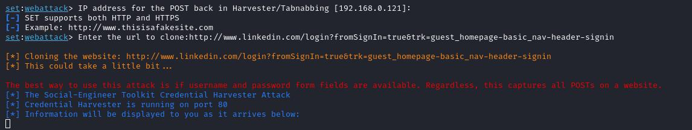
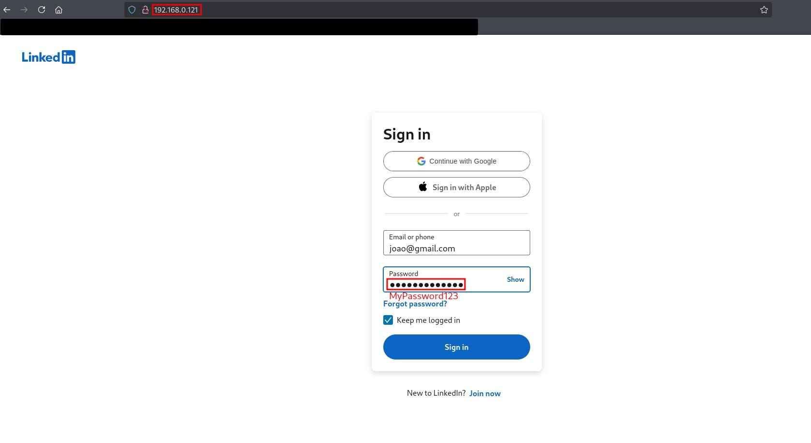
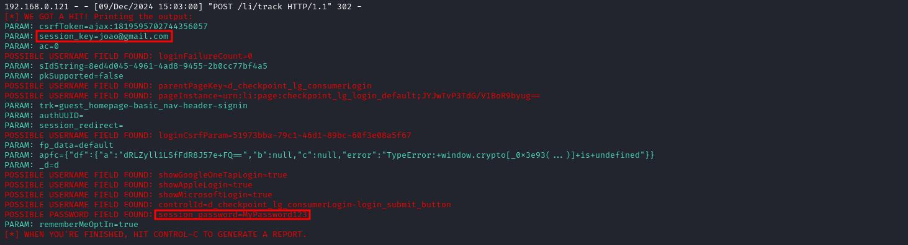

# Phishing para captura de senhas do Linkedin

## Ferramentas

- Kali Linux
- setoolkit

## Configurando o Phishing no Kali Linux

- Acesso root: ``` sudo su ```
- Iniciando o setoolkit: ``` setoolkit ```
- Tipo de ataque: ``` Social-Engineering Attacks ```
- Vetor de ataque: ``` Web Site Attack Vectors ```
- Método de ataque: ```Credential Harvester Attack Method ```
- Método de ataque: ``` Site Cloner ```
- Obtendo o endereço da máquina: ``` ifconfig ``` ou ``` ip a ```
- URL para clone: http://www.linkedin.com/login?fromSignIn=true&trk=guest_homepage-basic_nav-header-signin




## Resutados

### Form Clonado


### Captura do POST com as credenciais roubadas

